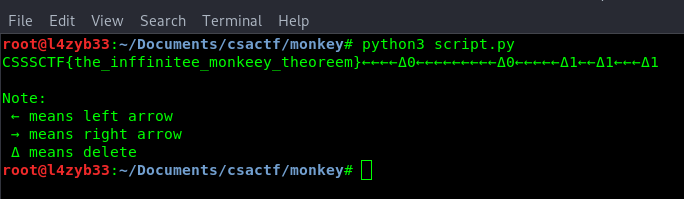
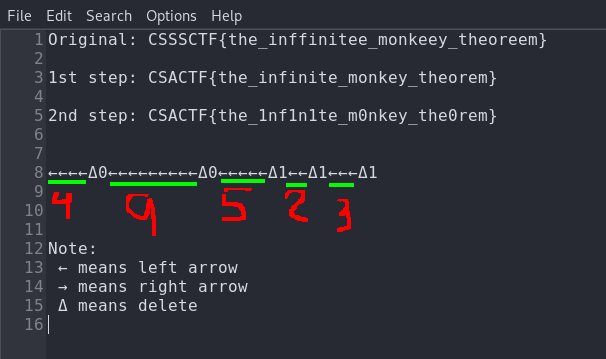

# CSActf-writeups-2019

### Forensics

 #### Zippy (50pts)

  In this challenge, we were given a zip file and a message:
  > Got a zip file, but our stupid admin, Blue, couldn't even open it. Can you?
  
  When I tried to unzip the [zip file](zippy/flag.zip), got nothing but an error. Then I checked with <tt>file</tt> command to know it is zip file or something else. (Don't trust extensions LOL!:joy:)
  
  
  
  OK, it is a zip file. Let's check with <tt>bless</tt> or your favourite hex editor.
  
  
  
  After googling, I found the structure a zip file [here](https://users.cs.jmu.edu/buchhofp/forensics/formats/pkzip.html "The structure of a PKzip file")
  
  
  
  But our zip file is missing **50 4B 03 04**.
  
  
  
  Let's add these magic number in it.
  
  
  
  Then extract the zip...
  
  
  
  Bingo! We got the flag.
  
  *CSACTF{z1ppy_z1p_z1p}*

---

 ### Monkey (~~496pts~~)(68pts)
  Before I solve this challenge, it was 496pts but after I solved it, it changed to 68pts.:joy:
  
  This challenge give us a pcapng file named [monkey](monkey/monkey.pcapng) and this message:
  > Have you ever heard of the Infinite Monkey Theorem?
Anyway, we have a pcap. Can you retrieve the flag from it?

 No, I've never heard of the IMT :joy:. But I read about it in wikipedia.
 https://en.wikipedia.org/wiki/Infinite_monkey_theorem
 
 (*Note: PCAPNG stands for "PCAP Next Generation Dump File Format".It can be opened with packet sniffers such as wireshark, tshark, tcpdump, solarwind,etc.*)
 
 I opened the file with wireshark and added the leftover capture data to the column.
 
 
 
 It is a usb traffic caputred file. After analyzing it for a few minutes, I knew that it was the capture of usb keyboard traffic and the flag was hidden in keystrokes. OK, let's take out the leftover capture data using tshark (wireshark can also be used).
 Don't know how to use tshark? [Here](https://www.wireshark.org/docs/man-pages/tshark.html) is the link.  
 
 
 
 We got 8 bytes of data.
 
 *Note:*
 - Byte 0: modifier keys (Control, Shift, Alt, etc.), where each bit corresponds to a key
 - Byte 1: unused/reserved, it's value is always NULL (0x00)
 - Byte 2-7: keypress
 
 https://wiki.osdev.org/USB_Human_Interface_Devices
 
 I wrote a script in python3, by utilizing [this](https://gist.github.com/MightyPork/6da26e382a7ad91b5496ee55fdc73db2), to convert usb.capdata to keystokes which were pressed by user. **Thank you, MigthyPork.**
 
 [Here](monkey/script.py) is my script.
 
 Ran the script and got this:
 
 
 
 *CSSSCTF{the_inffinitee_monkeey_theoreem}* looks like a flag. After reading about Infinite Monkey Theorem, I thought that I need to edit this pre-flag. (*If you do manual conversion, you will get this, CSACTF{the_infinite_monkey_theorem}. This is because I used only byte 1 and byte 3 of usb.capdata in my script*)
 
 Note:
 > The Infinite Monkey Theorem is a proposition that an unlimited number of monkeys, given typewriters and sufficient time, will eventually produce a particular text, such as Hamlet or even the complete works of Shakespeare.
The reasoning behind that supposition is that, given infinite time, random input should produce all possible output.

First, I replaced *CSSSCTF* with *CSACTF* and removed extra letters. 
Then I followed the user's typing keys. After **}** user press 4 **left arrows**, **delete o** by pressing *backspace* not *delete key* and press **0**; press 9 **left arrows**,.....,press *1*.  

Finally, we got the flag.:joy:

*CSACTF{the_1nf1n1te_m0nkey_the0rem}*

**P.S: This challenge is my second ctf forensics challenge in my life after zippy. Before this, I don't even know what pcap is and how to analyze it. Honestly, it took 17 hours for me to solve this challenge.** :blush:
